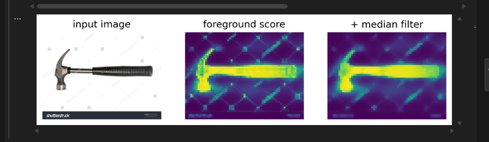

Jeg har tatt bilder av hammer. 

Laget masker med paint og lagret disse som .png.

mask_treatment.ipynb
Brukte google gemini for å lage et script som inverterte masken så objektet ble sort og bakgrunnen gjennomsiktig.

Oppdaget også at noen bilder kom ut med feil orientering, så fikk også laget et script som sørget for riktig orientering av bildet.

02_DinoV3/foreground_segmentation.ipynb

Benyttet allerede gitt kode for å trene modellen på mine bilder og masker. Måtte endre litt på koden for å kunne kjøre på maskin uten gpu. 

Her er et bilde som er ukjent for modellen:

